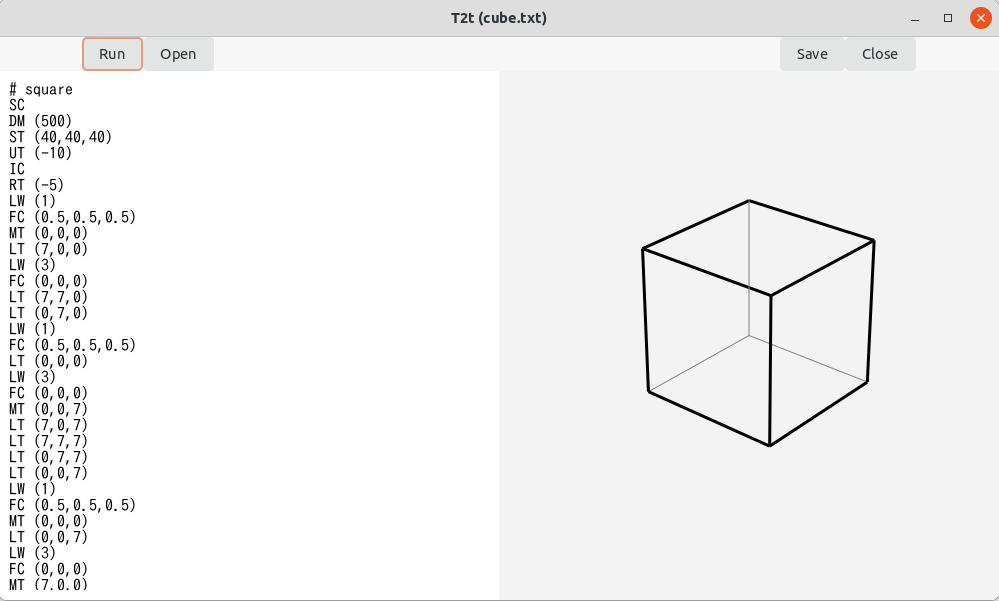
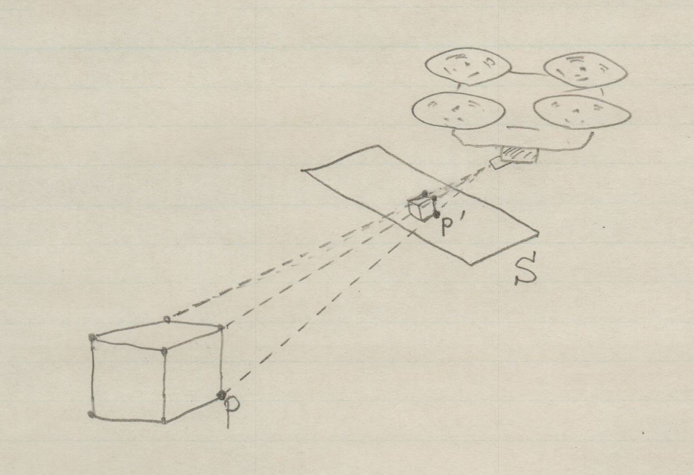

### T2Tとは？

T２Tは「Three dimension to Two dimension」を短くして作られた名前である。
その名のように、3次元の座標を2次元座標に変換するアプリケーションである。

例えば、立方体をスクリーンに写す場合、

1. 地上に固定された座標系で、各頂点を表す。
例えば、一辺が1の立方体の頂点の座標は、下記のように表せる。
2. これを空中にドローンで撮影したとする。
立方体は２次元の画像になり、各頂点は画像における2次元座標で表すことができる。
3. その座標を用いて、ディスプレイ上に画像を表示する。

（立方体の各頂点の座標）

~~~
(0,0,0)
(1,0,0)
(1,1,0)
(0,1,0)
(0,0,1)
(1,0,1)
(1,1,1)
(0,1,1)
~~~

### チュートリアル

端末から次のようにタイプして、t2tを起動する。

~~~
$ t2t
~~~

exampleフォルダにcube.txtというテキストファイルがある。
それを読み込む。

- Openボタンをクリックする。
- ファイル選択のダイアログが開く
- exampleフォルダのcube.txtをダブルクリック

画面の左半分のウィンドウにcube.txtの内容が表示される。
この内容は立方体を表示するものである。
各コマンドについては後の節で説明する。

Runボタンをクリックすると、右側のウィンドウに立方体が表示される。

### t2tの座標変換の概要

t2tのモデルは、地面の物体とそれを撮影するドローンとカメラである。
ここでの説明では、「地面」、「ドローン」、「カメラ」という言葉を用いることにする。
地面の座標系Gは、固定された正規直交座標系で次の条件を満たす。

- z軸は鉛直方向
- x軸とy軸は水平方向
- 座標系は右手系とする

座標系Gの原点をOとする。

ドローンの位置をO'とする。
ドローンの位置は地面の座標系Gの原点Oとドローンの位置O'を結ぶベクトルt=OO'によって決まる。

ドローンにつけられたカメラを基準にした座標系Dを考える。

- Dの原点はO'とする。
カメラとドローンの大きさは無視するので、O'はドローンの位置であると同時にカメラの位置でもある。
- カメラの向きと座標系Dのz軸の正方向は一致する。
カメラの右方向とx軸の正方向、カメラの上方向とy軸の正方向は一致する。
したがって、座標系Dは左手系である。
- カメラの向きが変わると、座標系Dも変わる。

ドローンの撮影した画像は、2次元である。
この画像は、次の図の平面Sに投影された像であると考えることができる。
図において、空間上の点Pとカメラの原点O'を結んだ直線と平面Sの交点が点P'である。
（現実には、カメラ内の撮像素子に像が生成されるのだが、それと平面Sの像は相似であるから、撮像素子の代わりに平面Sを使うのである）。
Sには2次元座標Sがある（同じ文字Sを用いるが、その区別は文脈によって判断できるだろう）。

t2tは点Pの座標を、座標系Gから座標系D、座標系Sの順に計算する。
座標系Sに基づいて、t2tは右半分のウィンドウに物体の像を表示する。
ただ、t2tは線分を表示することしかできないので、立方体のような点を線分で結んだ物体しか表示することはできない。

### コマンド解説

t2tの左半分のウィンドウはテキストエディタになっている。
そこにt2tのプログラムを入力することができる。
また、ファイルへの保存、ファイルからの読み込みも、それぞれ「Open」「Save」ボタンをクリックすることによりできる。
「Close」ボタンはウィンドウを閉じ、t2tを終了させる。
「Run」コマンドは、プログラムを実行し、画像を右半分のウィンドウに表示する。

プログラムはステートメントの並びである。
ステートメントはコマンドと引数からなる。

~~~
LW (式)
~~~

描画する線分の太さ(cairoのユーザー・スペースにおけるペンの直径）を設定する。
デフォルトは2である。

~~~
MT (式, 式, 式)
~~~

空間内の「現在の点」の位置を定める。
「MT」は「Move To」ということである。
3つの引数はその点の座標である。

「式」と書かれているのは、数字や変数の和、差、積、商、単項マイナス、カッコで表される数式である。
式の値は実数（Cのdouble型）で計算される。

~~~
LT (式, 式, 式)
~~~

現在の位置からを引数の位置まで直線を引く。
「LT」は「Line To」ということである。

~~~
FC (式, 式, 式)
~~~

フォアグラウンド・カラーを設定する。
引数は順にRGBであり、0から1までの値である。

~~~
BC (式, 式, 式)
~~~

バックグラウンドカラーを設定する。
引数は順にRGBであり、0から1までの値である。
この命令は、それまでに描画した図形をクリアし、ドローイングエリア全体を背景色で塗りつぶす。
したがって、背景色の設定は他の描画よりも前に行うべきである。

~~~
ST (式, 式, 式)
~~~
ベクトルtを設定する。
tは地上の座標系Gの原点Oから、ドローンの位置O'までのベクトルである。

「ST」は「Set T」の意味である。
デフォルトは(10,10,10)である。

~~~
UT (式)
~~~

ドローンを鉛直方向に上昇させる。
すなわち、tのz座標が引数の値だけ増加する。
引数が負ならばドローンを降下させる。

「UT」は「Up T」の意味である。

~~~
RT (式)
~~~

地面の座標系の原点Oを通る鉛直な直線とドローンを含む水平面の交点を中心として、ドローンを水平面内で回転させる。
回転の方向はx軸からy軸への方向を正とする。
引数はその回転の角度で、単位は度数法（1周が360度）である。
ドローンは回転とともにその向きも変わる。
しかし、カメラはドローンに固定されたままなので、ドローンを基準としたカメラの向きは変わらない。
例えば、もしドローンが原点Oを向いていたとしたら、RT実行後もドローンはOを向いている。

「RT」は「Rotate T」の意味である。

~~~
ZT (式)
~~~

引数を倍率として原点にドローンを近づける。
より正確には、引数の逆数のスカラー倍をtに対して行う。
例えば、引数が2えあれば、tの向きは変えずに大きさを1/2にする。
したがって、ドローンは原点Oに近づく（Zoom In）。
引数が1/2のときはtの大きさは2倍になる（Zoom Out)。
引数は正でなければならない。
負の引数を与えたときは、tを変更しない。

「ZT」は「Zoom T in」の意味である。

~~~
IC
~~~

カメラの向きを地上の座標系Gの原点方向を向くようにする。
すなわち、

- カメラの座標系Dは、O'からOへ向かうようにz軸が設定される
- y軸は地面に対し鉛直方向のベクトルとz軸の作る平面上にあり、その向きが上を向いている（地面と反対側を向く）
- x軸は水平方向を向く

「IC」は「Initialize the direction of the Camera」の意味.

~~~
LU (式)
~~~

カメラを上方向に回転させる。
引数が負の場合は、下を向くように回転する。
引数は回転の角度で度数法を単位とする。

「LU」は「Look Up」の意味である。

~~~
LR (式)
~~~

カメラを右方向に回転させる。
引数が負の場合は、左を向くように回転する。
引数は回転の角度で度数法を単位とする。

「LR」は「Look Right」の意味である。

~~~
SD (式)
~~~

カメラから、平面S（スクリーンとなる平面）までの距離dを設定する。
デフォルトは3である。

「SD」は「Set D」の意味である。

~~~
AD (式)
~~~

カメラから平面Sまでの距離に引数の数値を加える。
これによって、スクリーン上の図形は小さくなる。

「AD」は「Add D」の意味である。

~~~
DM (式)
~~~

スクリーン上の画像を拡大する。
具体的には平面（スクリーン）Sの平面座標において、x座標、y座標に引数の値をかける。
初期値は72である。

「DM」は「Display Magnification」の意味である。

~~~
SC
~~~

実行するコードを標準出力に出力する。
このとき、MT、LTについては、引数（座標系Gの座標）に加えて、それを平面Sに2次元座標に変換した座標も表示する。

「SC」は「Show Codes」の意味である。

~~~
HC
~~~

実行するコードを標準出力に出力しない。

「HC」は「Hide Codes」の意味である。

# 変数

変数は英字で始まり英数字またはアンダースコアが続く。
変数はdouble型である。

~~~
変数名 = 式
~~~

変数への代入はステートメントである。

# 式

式は、変数や数字の算術演算で表される。
演算には次のものが含まれる。

- 加算
- 減算
- 乗算
- 除算
- 単項マイナス
- 括弧

また、組み込みの関数がある。

~~~
SIN (式)
COS (式)
~~~

これらは三角関数の値を返す。
引数の式は、角度を表す。
角度の単位は度である。

式の結果（値）はCのdouble型である。
数字の「1」と「1.0」は、ともにdouble型の1.0として処理される。

