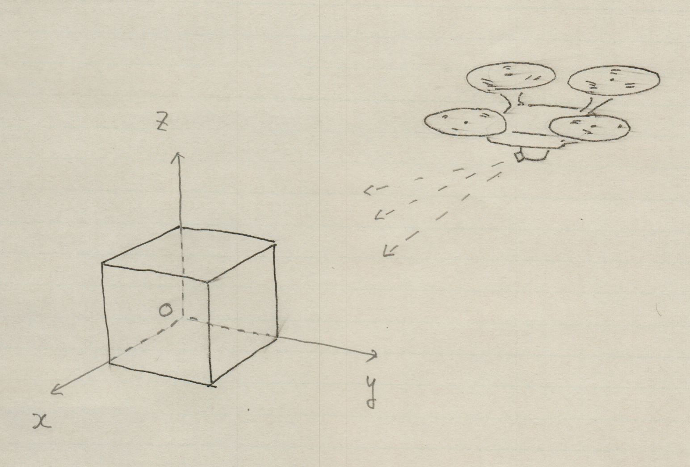

### T2Tとは？

T2Tをひとことで言えば、3次元座標を2次元座標に変換するアプリケーションである。
例えば、ドローンで地上の立方体を撮影することを考えてみよう。

立方体は地上の座標系(xyz)で各頂点を表すことができる。
それを、ドローンのカメラで撮影すると2次元の画像となる。
立方体の各頂点は画像内では平面座標で表される。

T2Tは地上の座標で表された点を、画像内の点の座標に変換する。

### 動作条件

1. Linuxオペレーティングシステム
2. Gtk4, GCC, meson, ninja

### インストール

1. 'Code'ボタンをクリックし、現れた小さなダイアログの'Download ZIP'をクリックする
2. ダウンロードしたZipファイルを解凍する
3. 端末を起動し、カレントディレクトリをzipファイルを解凍したディレクトリに移動する。次のようにタイプする。
4. meson _build
5. ninja -C _build
6. ninja -C _build install (認証が求められたらパスワードを入力)

### サンプルの使い方

端末からt2tとタイプし、起動する。
Openボタンをクリックし、example/cube.txtを読み込む。
Runボタンをクリックすると、右側のウィンドウに立方体が表示される。

### ドキュメント

詳しい操作方法とプログラムの概説は[doc.md](doc.md)に書かれている。

### ライセンス

Copyright (C) 2022  ToshioCP (関谷 敏雄)

t2tは、フリーソフトウェア財団によって発行された「GNU一般公衆利用許諾書」(バージョン3か、希望によってはそれ以降のバージョンのうちどれか)の定める条件の下で再頒布または改変することができる。

t2tは有用であることを願って頒布されますが、*全くの無保証* です。商業可能性の保証や特定の目的への適合性は、言外に示されたものも含め全く存在しません。
詳しくは[GNU 一般公衆利用許諾書(英語)](https://www.gnu.org/licenses/gpl-3.0.en.html)、またはその日本語訳[GNU 一般公衆利用許諾書の日本語訳](https://gpl.mhatta.org/gpl.ja.html)をご覧ください。

