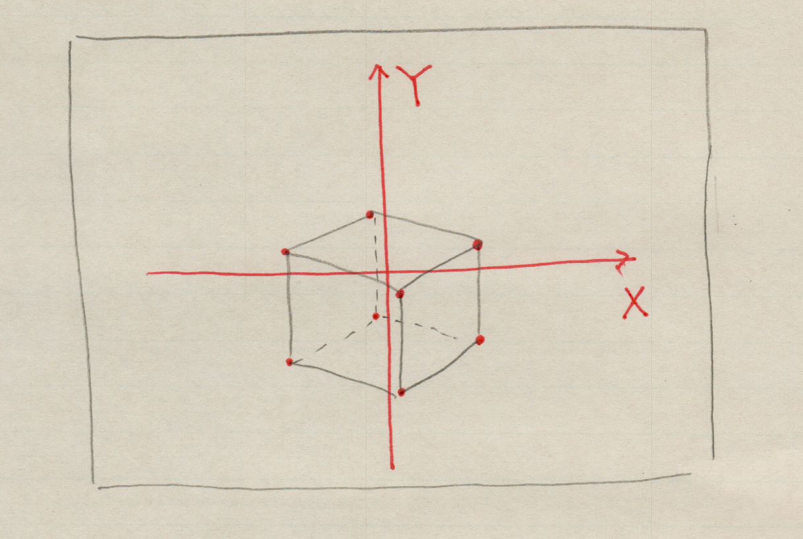

### What is T2T?

In a nutshell, T2T is an application that converts 3D coordinates to 2D coordinates.
For example, consider shooting a cube on the ground with a drone.

A cube can be represented by the coordinate of each vertex with the ground coordinate system (xyz).
If you take it with a drone camera, it will be a two-dimensional image.
Each vertex of the cube is represented in two-dimensional coordinates in the image.

T2T converts the coordinates on the ground into the coordinates in the image.

### Prerequisites

1. Linux operating system
2. Gtk4, GCC, meson, ninja

### install

1. Click the 'Clone or Download' button, then click 'Download ZIP' in the small dialog.
2. Unzip the downloaded Zip file
3. Start the terminal and move the current directory to the directory where you unzipped the zip file. Type as follows:
4. meson _build
5. ninja -C _build
6. ninja -C _build install (Enter password when prompted for authentication)

### How to use a sample

Type t2t from the terminal to start it.
Click the Open button and load example/cube.txt.
Click the Run button to see the cube in the right window.

### Document

Further information is described in [doc.md](doc.md).

### License

Copyright (C) 2022  ToshioCP (Toshio Sekiya)

T2t is free; you can redistribute it and/or modify it under the terms of the GNU General Public License as published by the Free Software Foundation; either version 3 of the License or, at your option, any later version.

T2t is distributed in the hope that it will be useful, but WITHOUT ANY WARRANTY; without even the implied warranty of MERCHANTABILITY or FITNESS FOR A PARTICULAR PURPOSE.
See the [GNU General Public License](https://www.gnu.org/licenses/gpl-3.0.html) for more details.

